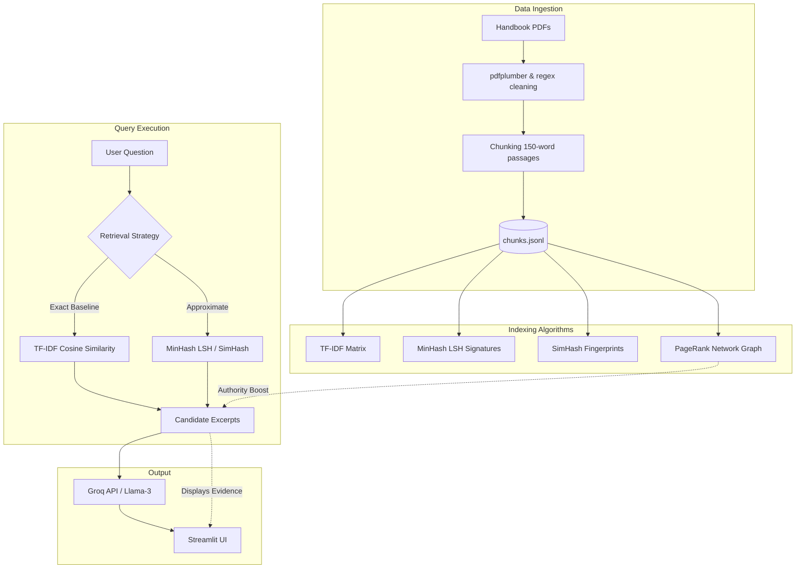

# SEECS Policy Guider

Live Demo: [yet to post]

A scalable academic policy question-answering system strictly grounded in the NUST SEECS Undergraduate and Postgraduate handbooks. This project operates as a strict Retrieval-Augmented Generation (RAG) pipeline.

## System Architecture



## How It Works

1. **Document Ingestion:** The system parses raw PDF handbooks, cleans the text, and chunks them into meaningful passages of roughly 150 words.
2. **The Retrieval Engine:** Three distinct search algorithms are implemented to test speed versus accuracy:
   * **TF-IDF (Exact Baseline):** Performs a full mathematical comparison of the query against every chunk.
   * **MinHash LSH:** An approximate retrieval method that generates text "shingles", compresses them into signatures, and uses Locality Sensitive Hashing to group similar chunks.
   * **SimHash:** An approximate method using 64-bit fingerprints and Hamming distance to find overlapping textual evidence.
3. **Bonus Extension: Knowledge Graph (PageRank):** Policies frequently cross-reference each other. The system builds a network graph of these cross-references and applies the PageRank algorithm to determine the most authoritative sections of the handbook. This acts as a smart tie-breaker to boost highly-referenced policies during a search.
4. **Answer Synthesis:** The system fetches the top relevant excerpts and strictly limits the LLM (Llama-3 via Groq) to synthesize a natural-language answer using only the retrieved evidence.

## Requirement Coverage

| Requirement | Status | Where |
| --- | --- | --- |
| PDF ingestion and cleaning | Implemented | `src/ingestion/`, `build_index.py` |
| 200-500 word chunking target | Implemented with tunable chunking | `chunk_pages(..., chunk_size=150, overlap=50)` |
| MinHash + LSH | Implemented from scratch | `src/indexing/minhash_lsh.py` |
| SimHash + Hamming distance | Implemented from scratch | `src/indexing/simhash.py` |
| TF-IDF cosine baseline | Implemented | `src/indexing/tfidf_retriever.py` |
| Query-time comparison | Implemented | `src/retrieval/pipeline.py`, `app.py` |
| Grounded answer generation | Implemented with optional Groq API | `src/generation/answer_gen.py` |
| Evidence and page/source display | Implemented | `app.py` |
| Competitive extension | PageRank section authority boost | `src/extensions/pagerank.py` |
| Required experiments | Implemented | `experiments/benchmark.py` |

## Project Structure

```text
src/
  ingestion/       PDF parsing, cleaning, and context-aware chunking
  indexing/        MinHash LSH, SimHash, and exact TF-IDF baseline
  retrieval/       Query pipeline with strict latency and memory tracking
  generation/      Grounded LLM answer synthesis (Groq API)
  extensions/      PageRank computation for policy cross-references
experiments/
  benchmark.py     Exact vs approximate, sensitivity, and scalability testing
  plots.py         Figure generation from benchmark results
data/
  processed/       Generated jsonl text chunks
  indexes/         Generated index binaries (not tracked in Git)
app.py             Streamlit dashboard
build_index.py     Generates data/ and indexes from raw PDFs
```

## Quick Start (Local)

```powershell
pip install -r requirements.txt
copy .env.example .env
python build_index.py
streamlit run app.py
```
*Note: Add your `GROQ_API_KEY` to `.env` if you want synthesized answers. Retrieval and analytics work purely locally without the LLM key.*

## Experiments

```powershell
python experiments/benchmark.py
python experiments/plots.py
```

Generated CSVs:

| File | Purpose |
| --- | --- |
| `exp1_comparison.csv` | TF-IDF vs Hybrid LSH vs MinHash vs SimHash latency, memory, Precision@5 |
| `exp2a_minhash_sensitivity.csv` | Effect of hash functions and bands |
| `exp2b_simhash_sensitivity.csv` | Effect of Hamming threshold |
| `exp3_scalability.csv` | Corpus duplication scalability test |
| `manual_evaluation_template.csv` | Blank template for manual human evaluation in final report |
